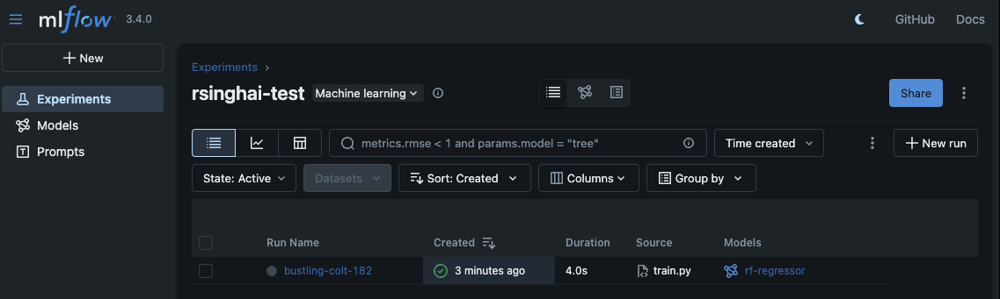
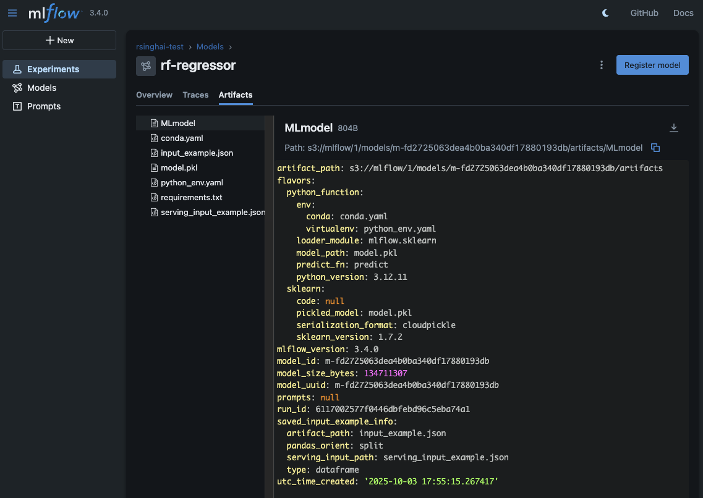
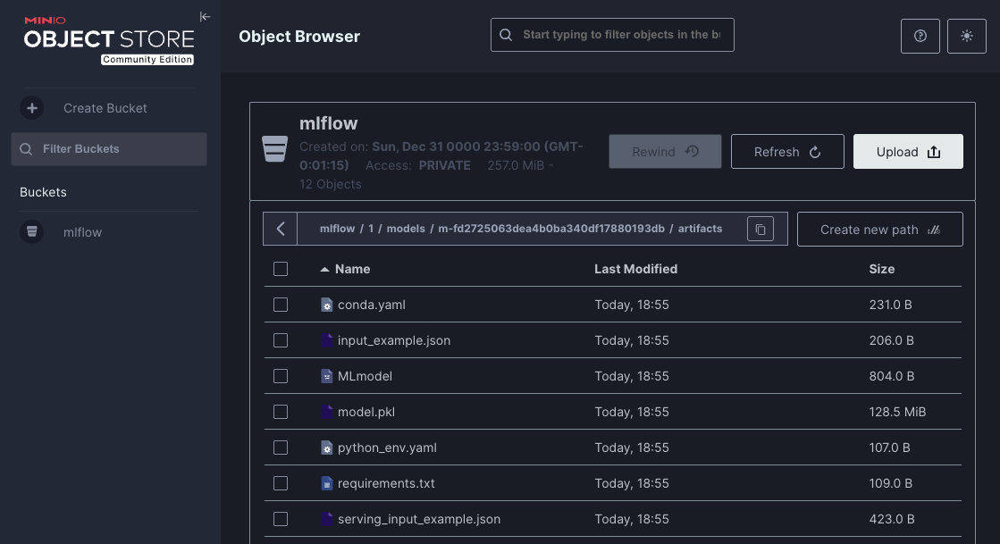

# Simple MLOps Pipeline on Your Local Machine

Docker Desktop, Kubernetes and Other Open Source Tooling to Demonstrate Machine Learning Process on your Laptop
Article Link: <https://medium.com/data-science/a-simple-mlops-pipeline-on-your-local-machine-db9326addf31>

It can be difficult to get any kind of ops experience outside of enterprise without turning to the cloud. The simple reason is that there’s little benefit in not turning to the cloud. In order to provide a zero-cost entry point into MLOps for those new to the space, I wanted to see if I could set up a simple MLOps pipeline in a reasonable amount of time on my personal laptop.
Some of technologies used will be:
* Python
* Docker/Kubernetes
* Mlflow
* Minio
* Seldon Core
* Github
* Jenkins
* ArgoCD

None of this is fit for production as outlined, but many of the principles and technologies are widely applicable.
You’ll really only need Docker Desktop to follow along.
This will enable you to run Kubernetes. However, you should also clone this cuurrent [repo](https://github.com/rahulsinghai/mlops-pipeline), as it has all of the additional scripts we’ll need.

## Serving Machine Learning Models with Seldon Core

Currently, Seldon Core supports a multitude of languages including Python, R, Java, NodeJS, and now Go (alpha).
The fundamental unit of execution in any **k8s cluster** is a **Pod**, which is always backed by one or more Docker containers.

Seldon Core has you first implement your model code under their **prediction API** and then wrap it within a Docker container.

The image you create can either be built via a _Dockerfile_ directly or using _OpenShift’s s2i_ tool with Seldon Core’s wrapper images as a base.

For our simple Python based service example, we will create it directly using a few simple Dockerfile directives.

## Experiment Management with Mlflow and Minio

One of the core tenets of data science that differentiates it from software engineering is its focus on _experimentation_.
With software, you develop, you test, and you push features that are primarily code-based.
In data science, on the other hand, you conduct heaps of experiments while making changes in configuration, data, features, etc.
The output isn’t even necessarily "completed code", but artifacts such as _model weights_.

Git-oriented source control isn’t the right tool for this problem.
To create a robust training pipeline, you’d have to build quite a bit.
Here, we’ll just ignore any restrictions on the model training approach and offload the results of our experiments in a central, shared repository.

[Mlflow](http://mlflow.org/) has become one of the most popular tools for experiment management.
While it does offer a lot more than simple tracking functions, we’ll be focusing on those for the purpose of this exercise.

First, create a new folder in the mlops-pipeline repo for the storage of our data.

```shell
# Clean up the local buckets directory (which contains MinIO data), you can run:
rm -fr ./house-price-prediction/experiment-tracking/buckets
mkdir -p ./house-price-prediction/experiment-tracking/buckets/mlflow
```

Then, you can use the docker-compose file in `experiment-tracking` to start our required services.

**Note**: sql volumes were omitted due to a hacky workaround for [this error](https://github.com/docker-library/mysql/issues/275).

We provide the environment variables in a `.env` file and build with

```shell
cd house-price-prediction/experiment-tracking
cp .env.example .env
docker-compose --env-file ./.env down
# Remove volumes as well, if you want all experiments purged in mlflow
docker-compose down -v

# Spin up minio, mlflow postgres, mlflow server containers
docker-compose --env-file ./.env up --build -d
```

Give it a minute, but this will start three services:
- Minio to simulate S3 storage
- PostgresSQL to store mlflow data
- Mlflow itself for both server and UI
These three services are now running inside a docker network, but Mlflow and minio have also been made available locally. Check the following URLs on your local machine:

- MLflow: <http://localhost:5050>
- Minio: <http://localhost:9001>

Now we can log metrics and models to the file storage using Mlflow. Since minio is available as “S3” inside our docker network, this is easiest to run from the container.

Running the code below in a terminal will start a session in the **mlflow_server** container. You can check which other containers are running with `docker ps`.
Now that we’re inside the container, we have access to the files within. If you’re using the GitHub repo, the following training script should already be available in the container.

```shell
docker exec -it mlflow_server bash
cat /training/train.py
exit
```

Pretty low-effort Python, but this is a quick and easy way to make sure that things are working.
Ideally, our training pipelines would extend to run anywhere and log artifacts back to `mlflow/minio` running in the cloud.
However, the fact that minio is running locally inside docker makes things trickier.
This is the simplest way for now.

```shell
docker exec -it mlflow_server python /training/train.py
```

If it ran successfully, you can navigate back to the minio and Mlflow UIs to check the performance and files logged by our run.







While this path contains the artifacts necessary to deploy with an Mlflow server, 
we’ll be following a different approach just using the serialized model: `model.pkl`.
To take this path further, you could work to [integrate `DVC`](https://dvc.org/doc), a popular command line tool for 
data versioning that works well with git.

## Machine Learning App

A popular way to serve machine learning artifacts, like _pickles_, is to package them with _flask APIs_ and serve them 
with a production ready web server like _gunicorn_.

To break the cycle a bit, I’m going to leverage the machine learning framework 
[seldon core](https://docs.seldon.ai/seldon-core-2) to serve our model.
This will contribute the additional benefit of making it ready for kubernetes.

Seldon provides out-of-the-box inference servers for libraries like _sklearn_ and _tensorflow_, but you can also use 
seldon-core to deploy a model with our own Docker container and code.
If you look at _mlops-pipeline/ml-app_, you’ll be able to view some of the code for Seldon.
The only thing we’re missing is our `model.pkl`, which we can get by copying from our local minio bucket.

```shell
cd ../

# MinIO client (mc) using S3 API (optional)

# Install MinIO client (mc) using Homebrew (macOS) or download from https://min.io/docs/minio/linux/reference/minio-mc.html
brew install minio-mc # macOS
mc alias set local http://localhost:9000 minio minio123

mc ls local/mlflow/1/models/<HASH>/artifacts/
mc ls local/mlflow/1/models/m-80c65239cbf6431ca114ebe684ffac8c/artifacts/
mc cp local/mlflow/1/models/m-80c65239cbf6431ca114ebe684ffac8c/artifacts/model.pkl ./ml-app/model.pkl
```

After you have `ml-app/model.pkl`, continue below.

Normally, we’d pull this right from the cloud when we deploy (I have a [download.py](ml-app/download.py) file for this 
if I ever need it), but this example is just to illustrate how you can test a deployment using Seldon.

Now, we just need three things:
1. `requirements.txt` for our model runtime
2. `Model.py` that defines a Model class
3. `Dockerfile` to containerize our model

Note the Seldon specific env variables and command at the bottom. Now, we can try running our model server:

```shell
cd ml-app
docker build -t house-price-model-seldon-app:0.1 .

# Clean any previous container
docker rm -f house-price-model-seldon-app 2>/dev/null || true

# Map both likely ports: 9000 (REST) and 5000 (gRPC/other)
# If you only map 5000 and send HTTP there you may see BadStatusLine due to gRPC traffic.
# Also, give the running container a name so you can exec into it later
docker run -d --rm --name house-price-model-seldon-app -p 9002:9000 -p 5001:5000 -p 6000:6000 house-price-model-seldon-app:0.1

# Check it is running
docker ps --filter name=house-price-model-seldon-app

# View logs (helpful for debugging startup issues):
docker logs --tail 40 house-price-model-seldon-app
docker logs -f house-price-model-seldon-app

# (Optional) Exec into the container (use /bin/sh if /bin/bash is not present):
docker exec -it house-price-model-seldon-app /bin/bash
exit
```

This should start the server locally and make it reachable at port 5001.
You can send a curl request, but it’s probably easier to run `python tests.py` in the directory.
It’s a short script I made to grab a dataframe row and send it over HTTP to our service for a prediction.

Quick endpoint probe (REST):
```shell
curl -i http://localhost:5001/predict || true
```

If you see an HTTP/1.1 200 with JSON (or at least a different error than a binary blob), port 9000 is correct for REST.

Run tests (auto-detects ports 9000, 5001, 5000):
Python test script (from repo root or inside `ml-app/`):

```shell
brew update
brew install pyenv
brew install uv

pyenv versions
pyenv install -l | less
pyenv install 3.12.11
pyenv global 3.12.11
python --version
pip install --upgrade pip
pip install virtualenv
pip install uv
uv --version

uv python set 3.12.11

cd house-price-prediction
# Initiate a new project
# uv init

# Create a virtual environment
uv venv
source .venv/bin/activate

uv sync

cd ml-app
pip install -r requirements.txt

python tests.py
```

### Troubleshooting BadStatusLine / Binary Noise

A traceback ending in `BadStatusLine('\x00\x00...')` means you sent an HTTP request to a gRPC (HTTP/2 framed) port.
Fix by:
1. Ensuring you mapped and are calling port 9000 for REST (`-p 9002:9000`).
2. Raw curl request (example with a single row—adjust values to a real row from the dataset):

  ```shell
  curl -X POST http://localhost:9002/predict \
    -H 'Content-Type: application/json' \
    -d '{"data":{"ndarray":[[3,1.5,1340,1340,7,1,0,5650,0,98178]]}}'
  ```

Expected style of JSON response (values will differ):

```json
{"data":{"names":[],"ndarray":[268788.9666666667]},"meta":{"metrics":[{"key":"mycounter","type":"COUNTER","value":1},{"key":"mygauge","type":"GAUGE","value":100},{"key":"mytimer","type":"TIMER","value":20.2}]}}
```

It works! Or at least it should.
Now, everything in this section really has nothing to do with ops. While our choice of serving framework has an effect on our pipeline, it’s nothing to do with CI/CD.
We definitely don’t want to run things manually every time we update our code or model, so let’s welcome some automation.
